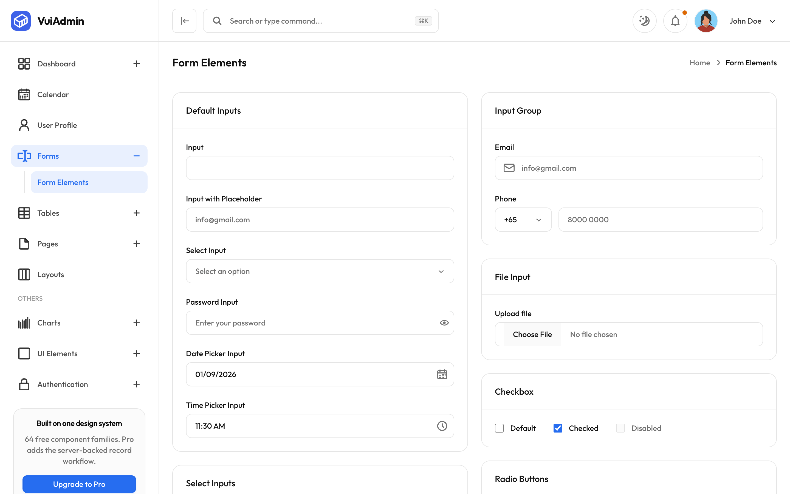
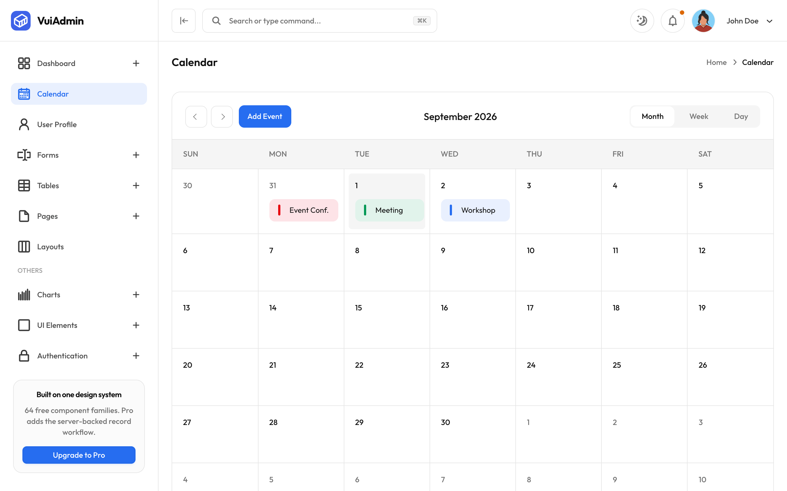
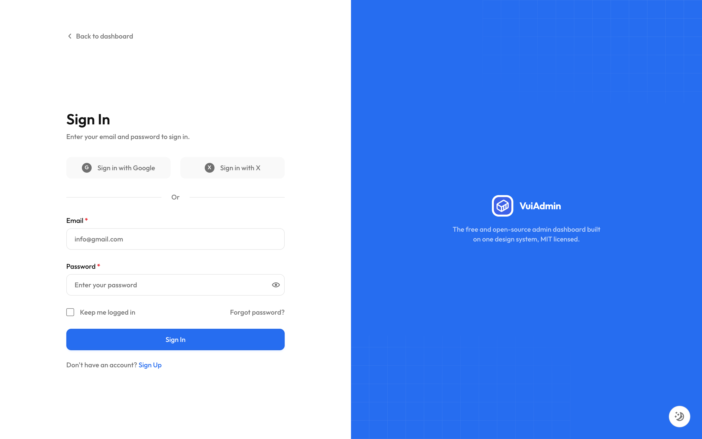

# VuiAdmin Next.js: Free Next.js Admin Dashboard Template

[](https://docs.viliha.com/docs/installation/nextjs)
[](https://nextjs.viliha.com)
[](https://nextjs.viliha.com)
[](./LICENSE)
[](https://github.com/myviliha/free-nextjs-admin-dashboard/actions/workflows/deploy.yml)
[](https://github.com/sponsors/myviliha)

## ❤️ Sponsoring is what keeps this free

VuiAdmin is the kind of admin theme that usually gets sold. We keep it MIT, and sponsors are what make
that possible.

Six framework editions of the same nineteen screens is more work than it sounds. A card has to be the
same card in Next.js as it is in the other five. Dark mode has to invert properly rather than
wash out. Every control needs keyboard and screen-reader behaviour, and every edition needs the parity
checks that stop them quietly drifting apart. We do that so you do not have to build it or buy it.

**Even $1 a month helps.** It goes toward bug fixes, new screens, and keeping the demos and docs
current. Honestly, it is what keeps us building in the open.

> Sponsors are listed on the [GitHub Sponsors page](https://github.com/sponsors/myviliha) and get our
> genuine thanks.

### 👉 [Sponsor on GitHub →](https://github.com/sponsors/myviliha) &nbsp;·&nbsp; thank you 🙏

---

**VuiAdmin** is a free, open-source **Next.js admin dashboard template** built on **Tailwind CSS v4**. Nineteen finished screens (dashboard, tables, forms, calendar, charts, authentication), MIT licensed, with no account, no key and no trial.

This is the **Next.js** edition: App Router, server components by default, prerendered to static
HTML. Fifteen of the nineteen pages ship no JavaScript of their own. If you would rather not have a
meta-framework at all, the [React edition](https://github.com/myviliha/free-reactjs-admin-dashboard)
is a plain Vite app.

**Next.js 16 (App Router, Turbopack) · React 19 · TypeScript · Tailwind CSS v4**

The same dashboard also ships for React, Vue, Angular, plain HTML and Laravel, all from one design
system, so you can change stack without changing product. [See all six editions](#all-six-editions).

---

## Documentation

The full documentation is at **[docs.viliha.com](https://docs.viliha.com)**: installation for every
edition, the folder structure, the app layout and the six shells, every component family, theming
and dark mode, breakpoints, and deployment.

- [Install the Next.js edition](https://docs.viliha.com/docs/installation/nextjs)
- [Project structure](https://docs.viliha.com/docs/structure/nextjs)
- [Colours and tokens](https://docs.viliha.com/docs/customization/colors)
- [Dark mode](https://docs.viliha.com/docs/customization/dark-mode)
- [Deployment](https://docs.viliha.com/docs/deployment)
- [FAQ](https://docs.viliha.com/docs/faq)

This README is the short version. Anything it leaves out is in the docs.

---


| Form elements | Calendar |
| ------------- | -------- |
| [](./docs/screenshots/forms.png) | [](./docs/screenshots/calendar.png) |

| Six shell layouts | Sign in |
| ----------------- | ------- |
| [](./docs/screenshots/layouts.png) | [](./docs/screenshots/signin.png) |

Every edition renders these same screens from the same fixtures, which is the whole point of the
design system underneath them, so one set of shots is the honest set for all six. Dark mode is the
toggle in the header on every screen.

---

## What is free and what is Pro

**Everything in this repository is free and MIT.** That is not a trial and it does not expire: every
version already published is MIT permanently, so nothing listed as free can move behind a paywall
later.

| Area | Free | Pro |
| --- | --- | --- |
| **Screens** | All nineteen: dashboard, calendar, profile, forms, tables, two chart pages, seven UI-element pages, six shell layouts, sign in, sign up, 404 | More dashboards (analytics, CRM, SaaS), and the screens that go with them |
| **Components** | 64 component families, in every one of the six editions | Premium blocks: billing, roles and permissions, audit log, inbox |
| **Design system** | Tokens, dark mode, six shell layouts, the icon and motion treatment, runtime theming | *Nothing extra* |
| **Data** | Fixtures in the file next to the screen, so you can see exactly where yours goes | The server-backed record workflow: list, detail, create, edit and delete against your own API |
| **Editions** | React, Next.js, Vue, Angular, HTML, Laravel | Svelte, and the record workflow in each |
| **Support** | Issues and discussions, in the open | Priority support and a commercial licence |

Pro is optional and additive: net-new work, not a fence around what is here.

## Contents

- [Documentation](#documentation)
- [What is free and what is Pro](#what-is-free-and-what-is-pro)
- [Features](#features)
- [Quick start](#quick-start)
- [What's in it](#whats-in-it)
- [Which Next.js features this uses, and why](#which-nextjs-features-this-uses-and-why)
- [Theming](#theming)
- [The nineteen routes](#the-nineteen-routes)
- [Project structure](#project-structure)
- [Deploying](#deploying)
- [All six editions](#all-six-editions)
- [License](#license)

---

## Features

- **One design system, six editions.** Colours, typography, radius, dark mode, the icon treatment and
  the six shell layouts all come from one token file. Change `--brand` and every screen follows, in
  every framework.
- **Nineteen screens that are finished**, not stubs. The dashboard has a real world map and three real
  charts; the tables have search, filter, sorting and row actions; the forms cover every input type
  including multi-select, date and time.
- **Dark mode that inverts properly.** It is a class on `<html>`, so it needs no JavaScript to *stay*
  applied, only to toggle. Charts, the map and the calendar all read the same tokens, so they follow.
- **Six shell layouts**, switchable at runtime and remembered: application, sectioned, three
  documentation variants and an icon rail with flyout submenus.
- **Fixtures next to the screen that uses them.** No mock server, no seed script, no schema to reverse
  engineer. Open a screen and you can see exactly where your data goes.
- **Accessibility that was actually done.** `aria-current` on the row you are on, roving tabindex and
  arrow keys on tab groups, `<dialog>` for modals so focus trapping comes from the platform, and no
  control that announces a popup with nothing behind it.
- **Parity checks in CI.** The sidebar, the shared route list and the screen map are held against each
  other in both directions, so a nav item with no page and a page with no nav item both fail the build
  rather than shipping.

---

## Quick start

Requires **Node.js 20+**.

```bash
npx @viliha/free-admin-dashboard my-app --nextjs
cd my-app
pnpm dev
```

That fetches this edition, installs it, and leaves you a project of your own rather than a copy of this repository. It works with pnpm, npm, yarn and bun: pnpm is the default, and `--npm`, `--yarn` or `--bun` picks another.

Then open [http://localhost:3000](http://localhost:3000).

Prefer to clone the repository, history and all?

```bash
git clone git@github.com:myviliha/free-nextjs-admin-dashboard.git
cd free-nextjs-admin-dashboard
npm install
npm run dev
```

### Scripts

| Script | What it does |
| --- | --- |
| `npm run dev` | Next dev server on port 3000 |
| `npm run build` | Static export into `out/` |
| `npm start` | Serve the exported `out/` on port 3000 (run `build` first) |
| `npm run check-types` | `tsc --noEmit` |
| `npm test` | Route tree, sidebar and fixture checks (`vitest`) |

---

## What's in it

- **Dashboard**: metrics, monthly sales, a monthly target gauge, a statistics area chart with
  monthly/quarterly/annual views, a customers-by-country world map, and recent orders
- **Calendar**: add, edit and delete events, month/week/day views
- **User profile**: profile, address, security and danger-zone cards, each with an edit dialog
- **Forms**: the full input set: text, select, multi-select, date, time, radio, checkbox, switch,
  file upload, password with a reveal toggle
- **Tables**: recent deals, top products, latest transactions and featured campaigns, with search,
  filter and row actions
- **Charts**: line and bar, themed from the same tokens as everything else
- **UI elements**: alerts, avatars, badges, buttons, images, modals, videos
- **Authentication**: sign in and sign up on a split-screen layout, with social buttons
- **Pages**: a blank page to start from, six shell layouts, and a 404

Plus the things a dashboard is actually judged on: a collapsible sidebar that keeps its state across
navigation, a rail mode with flyout submenus, dark mode, a route progress bar, and `aria-current` on
the row you are really on.

### What is deliberately not here

The searchable and multi-select dropdowns, drag-and-drop upload, the advanced data table and the other
dashboards. Those are Pro, and they are **absent** rather than shown disabled: a control you cannot
use is worse than one you can see is not included.

---

## Which Next.js features this uses, and why

The point of a Next edition is the framework, so it uses it rather than shipping a React app that
happens to live inside `app/`:

- **Server components by default.** Fifteen of the nineteen pages ship no JavaScript of their own. The
  four that need state (calendar, layouts and the two chart pages) are split: a server `page.tsx`
  owns the `metadata`, and a client component beside it does the work. That split is not decoration;
  `metadata` cannot be exported from a `"use client"` module, which is why those four routes once had
  no title of their own and inherited the layout's default.
- **`metadata` per route**, with a template in the root layout, so a tab reads
  `Basic Tables · VuiAdmin free`. **`viewport`** is a separate export, as Next has required since 14:
  left inside `metadata`, `themeColor` is silently ignored and nothing tells you.
- **`loading.tsx` in the shell route group**, so a navigation paints a skeleton *inside* the sidebar and
  header instead of blanking them. Next wraps the segment in `<Suspense>` for you; the placement is the
  whole decision.
- **`error.tsx` and `global-error.tsx`**: a recoverable boundary using Next's `reset`, and a last
  resort for the root layout itself throwing, which `error.tsx` structurally cannot catch.
- **`next/image`** (imported as `NextImage`) and **`next/link`** (as `NextLink`), the latter injected
  into the design system's shell as a prop. The component package has no framework router of its own,
  and must not gain one.
- **`next/font`** self-hosts Outfit at build time, so there is no third-party font request and the demo
  renders in the right face offline.
- **`next/dynamic` with `ssr: false`** for ApexCharts, which touches `window` while its module
  evaluates. Its `loading` option reserves the chart's box.
- **`next.config.ts`**, typed, so a misspelled option is an error rather than a setting that quietly
  does nothing.

---

## Theming

Every design decision is a CSS custom property, so you override rather than edit:

```css
:root {
  --brand: #266df0;          /* --primary aliases this, so both move together */
  --radius: 0.625rem;        /* buttons, inputs, menu rows */
  --vui-card-radius: 1rem;   /* cards, on their own scale */
  --background: oklch(100% 0 0);
  --foreground: oklch(17.7% 0 0);
}
```

Dark mode is the `dark` class on `<html>`; the token file ships a `.dark` block that redefines the same
names. The chart colours, the world map's landmass and the calendar's event tones are all derived from
these, which is why they follow a theme change without per-component styling.

---

## The nineteen routes

Sixteen behind the shell, two auth screens outside it, and a 404.

| Behind the shell | Outside it |
| --- | --- |
| `/` dashboard, `/calendar`, `/profile`, `/form-elements`, `/basic-tables`, `/blank` | `/signin` |
| `/alerts`, `/avatars`, `/badge`, `/buttons`, `/images`, `/videos`, `/modals` | `/signup` |
| `/line-chart`, `/bar-chart`, `/layouts` | `/error-404` |

`FREE_NAV` in `@viliha/vui-core` is the one list the sidebar and the route set both read, so they
cannot disagree, and the route list is derived from it. Every edition reads the same list, which is
why it lives in the package rather than in each app.

---

## Project structure

```
app/
  layout.tsx          root layout: metadata, viewport, next/font
  loading.tsx         route-level loading UI outside the shell
  error.tsx           recoverable error boundary
  global-error.tsx    the root layout itself failing
  not-found.tsx       unmatched addresses
  (shell)/            the sixteen screens with sidebar and header
    layout.tsx        the shell, and the layout provider above it
    loading.tsx       the skeleton that renders inside the shell
  (auth)/             sign in and sign up, split-screen, no navigation
  dashboard/          the dashboard's cards, charts and map
  globals.css         Tailwind plus the design system's tokens
packages/
  vui-core/           framework-free half: tokens, class strings, fixtures, the route list
  vui-react/          the React components
public/
  CNAME               the custom domain, read by Pages on every deploy
  .nojekyll           stops Pages dropping _next/ for its leading underscore
routes.test.ts        the sidebar and the route tree, held against each other
fixtures.test.ts      the demo names no real person
```

---

## Deploying

`npm run build` writes a static build, with no Node process to run. Upload it anywhere.

Two files in `public/` are load-bearing and ship **inside** the build rather than being set once in
the repository settings: `CNAME` carries the custom domain, which Pages re-reads on every deploy,
and `.nojekyll` stops Pages ignoring `_next/` for beginning with an underscore, and that failure
serves your HTML with none of its CSS or JavaScript.

Prefer a Node host? Remove `output: "export"` and `images: { unoptimized: true }` from
`next.config.ts`. You get the image optimiser back and `npm start` becomes `next start`.

This repository publishes itself: [`.github/workflows/deploy.yml`](./.github/workflows/deploy.yml)
runs the checks and the build on every push to `main`, then deploys to GitHub Pages at
[nextjs.viliha.com](https://nextjs.viliha.com). A pull request runs the same checks and stops before
publishing.

---

## All six editions

| Edition | Repository | Live demo | Docs |
| --- | --- | --- | --- |
| React | [free-reactjs-admin-dashboard](https://github.com/myviliha/free-reactjs-admin-dashboard) | [react.viliha.com](https://react.viliha.com) | [Install](https://docs.viliha.com/docs/installation/react) |
| **Next.js** | *this repository* | [nextjs.viliha.com](https://nextjs.viliha.com) | [Install](https://docs.viliha.com/docs/installation/nextjs) |
| Vue | [free-vuejs-admin-dashboard](https://github.com/myviliha/free-vuejs-admin-dashboard) | [vuejs.viliha.com](https://vuejs.viliha.com) | [Install](https://docs.viliha.com/docs/installation/vue) |
| Angular | [free-angularjs-admin-dashboard](https://github.com/myviliha/free-angularjs-admin-dashboard) | [angularjs.viliha.com](https://angularjs.viliha.com) | [Install](https://docs.viliha.com/docs/installation/angular) |
| HTML | [free-html-admin-dashboard](https://github.com/myviliha/free-html-admin-dashboard) | [html.viliha.com](https://html.viliha.com) | [Install](https://docs.viliha.com/docs/installation/html) |
| Laravel | [free-laravel-admin-dashboard](https://github.com/myviliha/free-laravel-admin-dashboard) | [laravel.viliha.com](https://laravel.viliha.com) | [Install](https://docs.viliha.com/docs/installation/laravel) |

Same nineteen screens, same design system, same fixtures. Pick the one that matches your stack.

---

## Contributing

Issues and pull requests are welcome. The parity checks run on every pull request, so if you add a screen you will be told about the sidebar entry you forgot.

## License

[MIT](./LICENSE) © VILIHA PTE. LTD. Free for personal and commercial use.

Every version already published is MIT permanently, so nothing that is free today moves behind a paywall later. Teams who want more than that can read about [Pro](https://viliha.com), which is optional and additive.

---

Made with ♥ from Vietnam by the [Viliha Team](https://viliha.com). If VuiAdmin saved you time, [a sponsorship](https://github.com/sponsors/myviliha) is the best thank-you.
